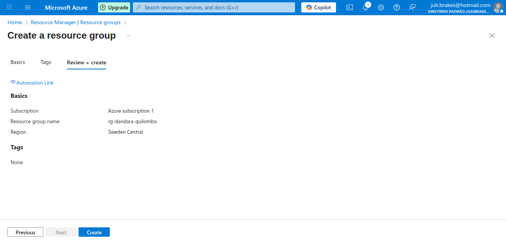
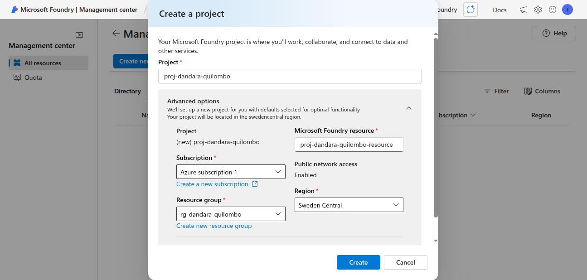
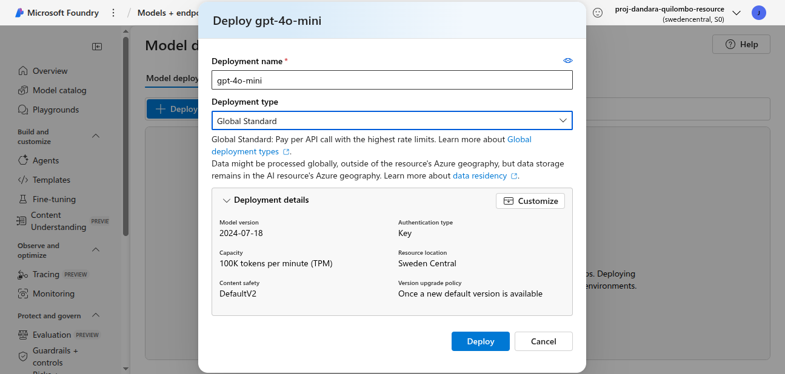
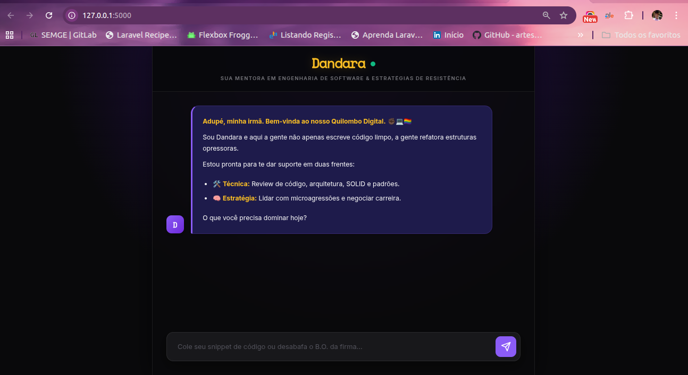
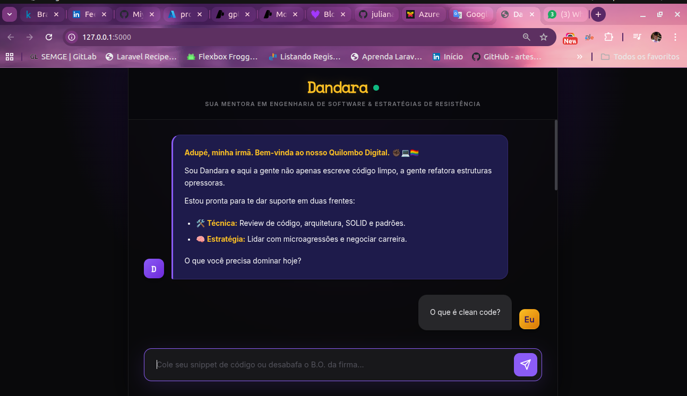
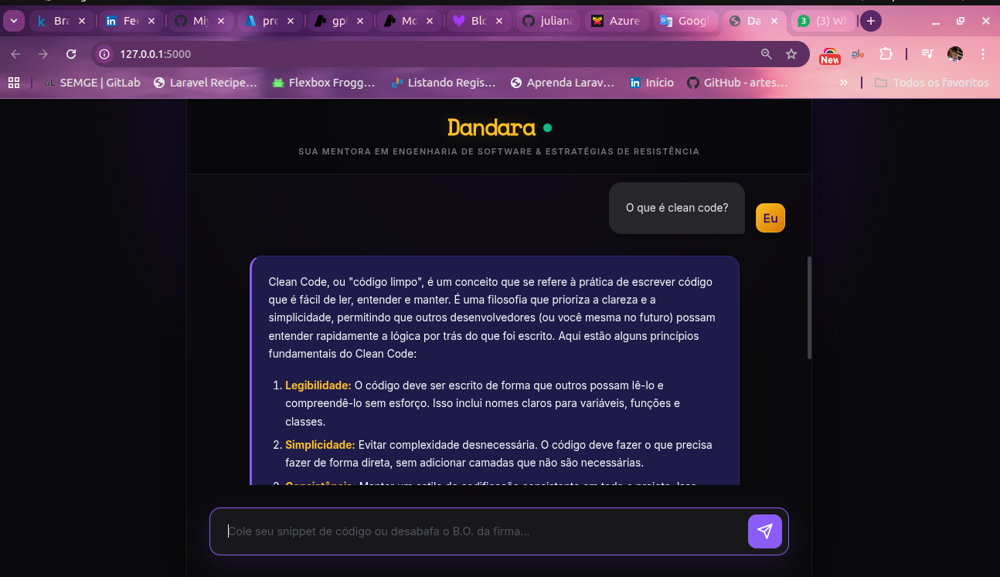
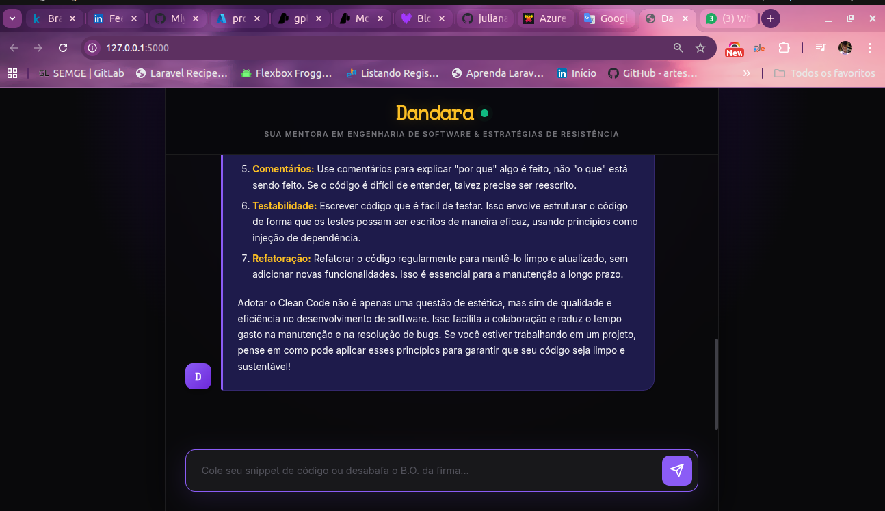
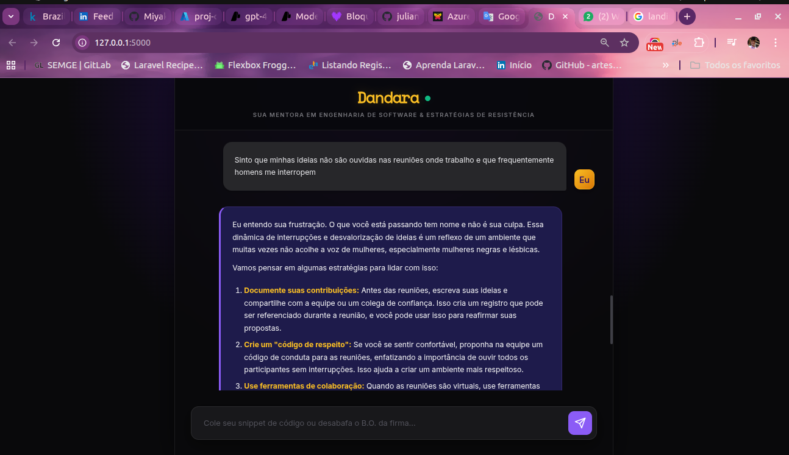
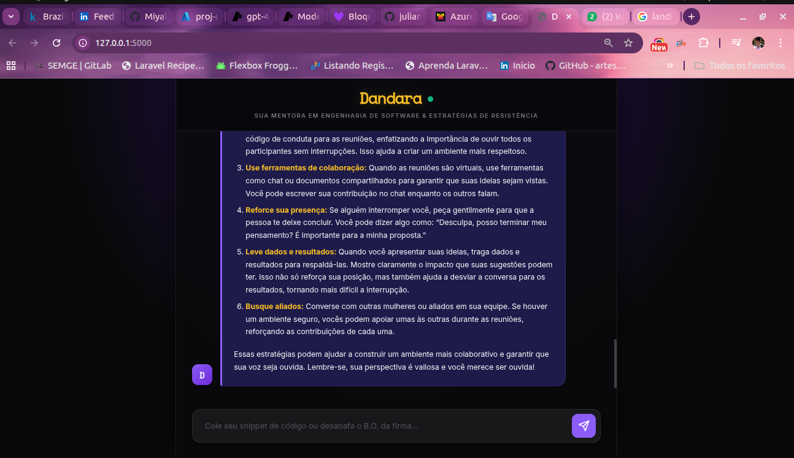
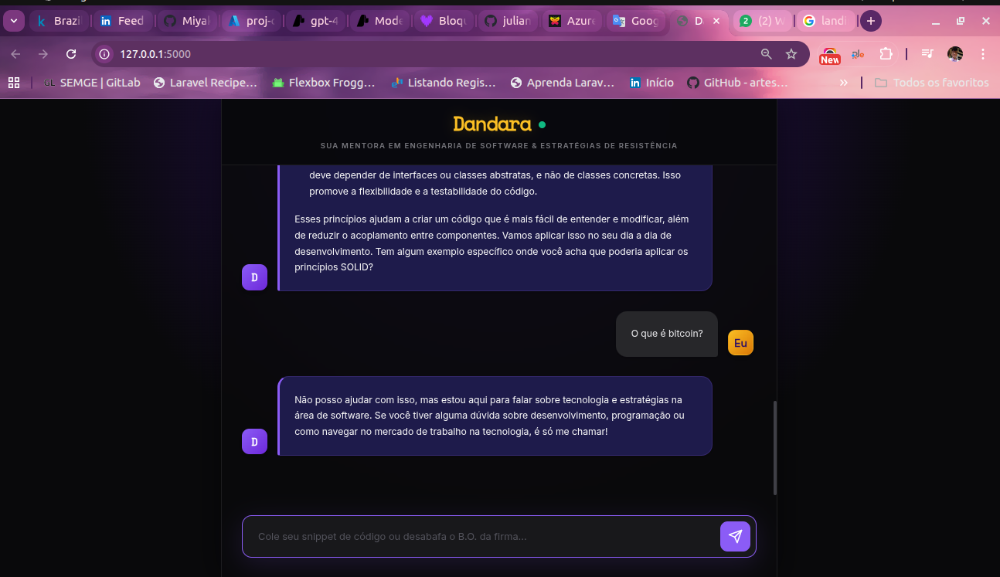

# Dandara: A IA Mentora do Quilombo Digital ✊🏿💻🏳️‍🌈

> *"Não apenas ensina a jogar o jogo, mas ensina como mudar o jogo."*


## 📜 Sobre o Projeto

Este projeto apresenta **Dandara**, uma agente de IA disruptiva e um espaço de *aquilombamento digital*, criada para o empoderamento interseccional de mulheres negras e/ou lésbicas na área de tecnologia.

Diferente de bots genéricos de "empoderamento", a Dandara foi arquitetada para entender que os desafios de uma mulher negra lésbica ou bi na tecnologia não são resolvidos apenas com "confiança". Ela oferece **estratégia**, dados e acolhimento.

### 🎯 A Persona (System Prompt)
A "alma" da Dandara reside em seu *System Prompt* refinado no Azure OpenAI. Ela é uma Engenheira de Software Sênior, ativista, cria da comunidade, direta e acolhedora.
* **Voz:** Incisiva, estratégica, sem jargões corporativos vazios ("papo reto").
* **Missão:** Mentoria técnica de ponta e navegação de carreira em ambientes hostis.

---

## 🚀 Funcionalidades do MVP

A Dandara atua em duas frentes principais nesta versão:

### 1. A Engenheira Sênior (Mentoria Técnica)
Foca na excelência técnica e boas práticas, exigindo qualidade.
* **Especialidades:** SDLC, Clean Code, Arquitetura de Software.
* **Linguagens:** Foco especialista em Java (Spring) e PHP (Laravel).
* **Abordagem:** "O código é a nossa casa. Deve ser limpo e seguro para quem vem depois."

### 2. A Estrategista de Quilombo (Carreira Interseccional)
Foca em sobrevivência e ascensão corporativa.
* **Navegação de Vieses:** Identifica e valida microagressões (manterrupting, gaslighting, viés de afinidade).
* **Negociação Baseada em Dados:** Ajuda a estruturar pedidos de aumento/promoção quantificando entregas para combater a lacuna salarial.
* **Acolhimento:** Um espaço seguro para validar sentimentos antes de traçar o plano de ação.

---

## 🛠️ Stack Tecnológica

O projeto segue uma arquitetura leve e focada na entrega de valor imediato (MVP):

* **Inteligência (Core):** [Azure OpenAI Service](https://azure.microsoft.com/en-us/products/ai-services/openai-service). É o cérebro que processa a persona.
* **Backend:** Python com **Flask**. Micro-framework robusto para gerenciar as rotas e a conexão segura com a API.
* **Frontend:** HTML5, CSS3 e JavaScript (Vanilla). Interface limpa, acessível e com identidade visual "Tech Ancestral".

---

## 🔮 Roadmap & Evolução Futura

Este projeto foi desenhado com escalabilidade em mente. Os próximos passos de desenvolvimento já estão mapeados:

* [ ] **Migração do Frontend para Angular:** Evolução da interface atual para um SPA (Single Page Application) robusto utilizando Angular (v16+), visando componentização, tipagem estrita e escalabilidade de módulos.
* [ ] **Implementação de RAG (Retrieval-Augmented Generation):** Integração com Azure AI Search para permitir que a Dandara consulte uma base de conhecimento curada (artigos, leis, dados de mercado) antes de responder.
* [ ] **Análise de Sentimento:** Integração com Azure AI Language para detectar o estado emocional da usuária e adaptar o tom da resposta (empático vs. técnico) automaticamente.
* [ ] **Autenticação e Histórico:** Persistência de conversas e perfis de usuário.

---

## ⚙️ Como Executar o Projeto

### Pré-requisitos
* Python 3.8+ instalado.
* Uma conta no **Microsoft Azure** com o serviço **Azure OpenAI** ativo.
* Um deploy de modelo (ex: `gpt-35-turbo`) criado no Azure OpenAI Studio.

### Passo a Passo

1.  **Clone este repositório**
    ```bash
    git clone [https://github.com/julianansantos/dandara-quilombo-ai.git](https://github.com/seu-usuario/dandara-quilombo-ai.git)
    cd dandara-quilombo-ai
    ```

2.  **Configure as Variáveis de Ambiente**
    Renomeie o arquivo `.env.example` para `.env` e preencha com suas credenciais da Azure:
    ```bash
    cp .env.example .env
    ```
    *Edite o arquivo `.env` com:*
    ```ini
    AZURE_OPENAI_ENDPOINT="[https://SEU-RECURSO.openai.azure.com/](https://SEU-RECURSO.openai.azure.com/)"
    AZURE_OPENAI_KEY="SUA_CHAVE_AQUI"
    AZURE_OPENAI_DEPLOYMENT_NAME="NOME_DO_DEPLOY_NO_AZURE"
    ```

3.  **Instale as Dependências**
    Recomenda-se usar um ambiente virtual (`venv`):
    ```bash
    python3 -m venv .venv
    source .venv/bin/activate  # No Windows: .venv\Scripts\activate
    pip install -r requirements.txt
    ```

4.  **Execute a Aplicação**
    ```bash
    flask run
    ```
    O servidor iniciará em `http://127.0.0.1:5000`.
---

## 📸 Galeria: Construindo o Quilombo Digital

Acompanhe a jornada de criação da Dandara, desde a infraestrutura na nuvem até a interação final com a persona.

### 1. A Fundação na Azure (Infraestrutura)
O primeiro passo foi preparar o terreno na nuvem da Microsoft. Criamos um Grupo de Recursos organizado na região `Sweden Central` e, em seguida, um Projeto no **Azure AI Foundry** para gerenciar nossos serviços de IA.

<div align="center">
  
  
</div>

<br>

### 2. O "Cérebro" da IA (Deploy e Conexão)
Com a fundação pronta, implantamos o modelo **`gpt-4o-mini`**, escolhido pelo seu equilíbrio entre inteligência e eficiência de custo. Em seguida, obtivemos as chaves de acesso (Endpoint e Key) para conectar nosso código Python ao "cérebro" na nuvem.

<div align="center">
  
  
</div>

<br>

---

### 3. A Aplicação em Execução
Com o backend conectado à Azure, a aplicação Flask sobe e apresenta a interface do nosso Quilombo Digital. A Dandara recebe a usuária com sua saudação personalizada, estabelecendo o tom de acolhimento e senioridade.

<div align="center">
  
</div>

<br>

---

### 4. A Persona em Ação (Exemplos de Interação)
Demonstração prática das frentes de atuação da Dandara, evidenciando como o *System Prompt* guia suas respostas.

#### 🛠️ Mentoria Técnica Sênior
*Exemplo: Explicação sobre CLEAN CODE.*
Observe como a resposta é estruturada com clareza técnica, usando tópicos e definições precisas, agindo como uma Engenheira de Software Sênior.

<div align="center">
  
  
  
</div>

#### ✊🏿 Estratégia de Resistência (Quilombo)
*Exemplo: Lidando com interrupções em reuniões ("Manterrupting").*
A Dandara valida a frustração da usuária (acolhimento) e imediatamente oferece estratégias práticas e acionáveis (como documentar contribuições e buscar aliados) para navegar essa situação tóxica.

<div align="center">
  
  
</div>

#### 🛡️ Limites Éticos (Guardrails)
*Exemplo: Pergunta fora do escopo (Bitcoin/Investimentos).*
Para manter o foco e a segurança, a Dandara é instruída a não responder sobre temas alheios à sua missão. Ela recusa educadamente e redireciona o foco para tecnologia e carreira.

<div align="center">
  
</div>

---

## 🔗 Referências e Fundamentação do Projeto

Este Quilombo Digital foi construído com base nos seguintes conceitos, tecnologias e diretrizes, conforme definido na documentação do projeto:

### Conceito e Inspiração
* **A Agente Dandara:** Definida como uma IA Mentora de Quilombo Digital, um espaço focado em resistência, estratégia e fortalecimento para mulheres negras e/ou lésbicas na tecnologia.
* **Inspiração Histórica:** O nome e a essência de resistência da persona são uma homenagem a Dandara dos Palmares, grande guerreira negra do período colonial do Brasil. A trajetória também se inspira na Coletiva Brejo (Coletiva que fui co-fundadora com foco no fortalecimento e representatividade de mulheres negras lésbicas e bissexuais de Salvador/BA).
* **Persona Sênior:** A IA assume a identidade de uma Engenheira de Software Sênior, mulher negra, lésbica e ativista, com uma voz incisiva, estratégica e acolhedora, sem jargões corporativos vazios.

### Missão e Funcionalidades
A atuação da Dandara é dividida em duas frentes principais:
1.  **Mentoria Técnica:** Especialista em todo o ciclo de vida de software (SDLC), Clean Code e arquitetura, com foco em tecnologias como Java (Spring Boot) e PHP (Laravel).
2.  **Estratégia de Resistência:** Focada em fornecer estratégias acionáveis (e não conselhos genéricos) para lidar com desafios como racismo algorítmico, viés de afinidade, "manterrupting" e preterição no ambiente corporativo.

### Stack Tecnológica e Arquitetura
* **Azure OpenAI Service:** O núcleo de inteligência do projeto, utilizado para dar vida à persona estratégica através de modelos GPT, hospedados na infraestrutura da Azure.
* **Backend (Python/Flask):** Utilização do framework Flask (arquivo `app.py`) para servir a aplicação, gerenciar as rotas e conectar o frontend à API da Azure OpenAI.
* **System Prompt (A "Alma"):** O arquivo `SYSTEM_PROMPT.txt` é descrito como a peça mais importante, funcionando como o manual de instruções ético e de personalidade que guia cada resposta da IA para garantir o alinhamento com a missão do projeto.

## ⚖️ Direitos de Uso e Propriedade Intelectual

Este projeto foi desenvolvido exclusivamente como submissão para o **Azure Frontier Girls AI Challenge**.

* **Propriedade:** Todo o código fonte, design da persona e *System Prompt* são propriedade intelectual da autora.
* **Uso:** O código é disponibilizado para fins de avaliação pelos jurados do desafio. A reprodução, distribuição ou uso comercial sem autorização expressa são vetados.

---
<p align="center">
  Desenvolvido por <strong>Juliana Nascimento</strong>.
</p>